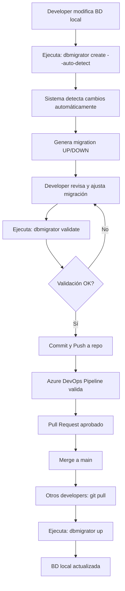
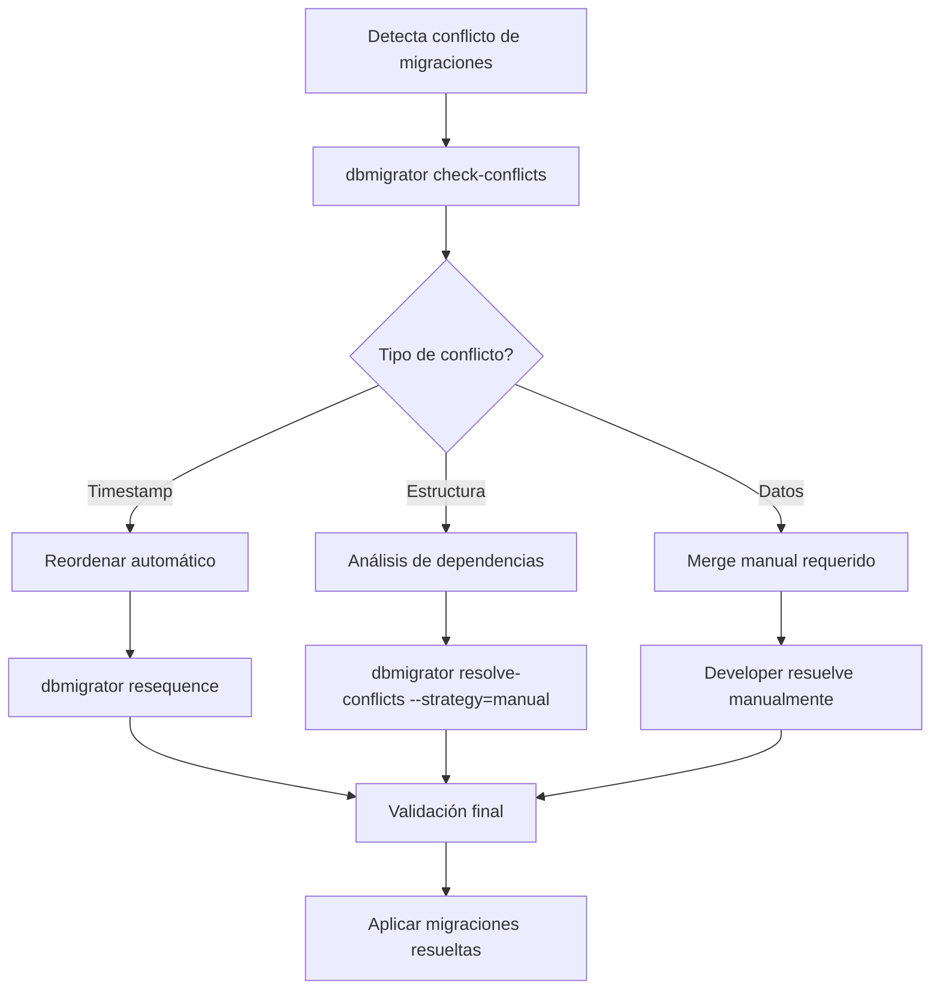

# DOCUMENTO DE ALCANCE - SISTEMA DE CONTROL DE MIGRACIONES POSTGRESQL
## **DBMigrator CLI v1.0**

---

## **1. RESUMEN EJECUTIVO**

Desarrollo de una herramienta CLI empresarial en .NET 8 para gestión automatizada de migraciones de base de datos PostgreSQL, diseñada para equipos de desarrollo que trabajan con múltiples proyectos y ambientes. La solución permitirá detectar, versionar, aplicar y revertir cambios de manera controlada, garantizando la sincronización entre ambientes de desarrollo, pruebas y producción.

### **1.1 Características Clave**
- 🔍 Detección automática de cambios en estructura y datos
- 📦 Soporte multi-proyecto y multi-ambiente
- 🔄 Rollback completo con scripts DOWN automáticos
- 🛡️ Sistema robusto de recuperación ante errores
- 📊 Tracking detallado y auditoría completa
- 🚀 Integración con Azure DevOps
- 💻 Multiplataforma (Windows, Linux, macOS)

---

## **2. OBJETIVOS**

### **2.1 Objetivo General**
Implementar una solución empresarial que permita a equipos de desarrollo mantener sincronizados los cambios de base de datos PostgreSQL entre múltiples proyectos, desarrolladores y ambientes, mediante un sistema robusto de versionado de migraciones.

### **2.2 Objetivos Específicos**
- ✅ Detectar automáticamente cambios en estructura y datos de PostgreSQL 13+
- ✅ Generar scripts de migración versionados con timestamp UTC
- ✅ Mantener trazabilidad completa de migraciones aplicadas
- ✅ Proveer capacidad de rollback para todos los cambios
- ✅ Soportar múltiples proyectos, ambientes (dev, test, prod) y schemas
- ✅ Minimizar conflictos en desarrollo colaborativo
- ✅ Garantizar recuperación ante fallos durante migraciones
- ✅ Facilitar la integración con pipelines CI/CD

---

## **3. ALCANCE FUNCIONAL**

### **3.1 Gestión Multi-Proyecto**

La herramienta soportará múltiples proyectos con configuraciones independientes:

```bash
# Inicialización de proyecto
dbmigrator init --project="ProjectA" --connection-string="..." 

# Cambio entre proyectos
dbmigrator use-project "ProjectB"

# Listar proyectos configurados
dbmigrator projects list
```

**Estructura de configuración:**
```
~/.dbmigrator/
  ├── global-config.json       # Configuración global
  ├── projects/
  │   ├── projectA/
  │   │   └── config.json
  │   └── projectB/
  │       └── config.json
```

### **3.2 Detección de Cambios**

#### **3.2.1 Elementos de Estructura**
- **Tablas**
  - Columnas (nombre, tipo, nullable, default)
  - Constraints (primary keys, foreign keys, unique, check)
  - Comentarios
- **Índices** (btree, hash, gin, gist, etc.)
- **Vistas** (normales y materializadas)
- **Funciones y Procedimientos**
- **Triggers**
- **Sequences**
- **Tipos de datos personalizados**
- **Schemas**

#### **3.2.2 Elementos de Datos**
- Tablas de configuración especificadas
- Datos semilla (seed data)
- Catálogos maestros
- Datos de referencia

### **3.3 Generación de Migraciones**

#### **3.3.1 Formato y Nomenclatura**
- **Formato:** SQL puro (.sql)
- **Nomenclatura:** `{yyyyMMddHHmmss}_{tipo}_{descripción}.sql`
- **Tipos de migración:**
  - `DDL` - Data Definition Language (estructura)
  - `DML` - Data Manipulation Language (datos)
  - `FNC` - Functions/Procedures
  - `VIW` - Views
  - `IDX` - Indexes
  - `TRG` - Triggers
  - `MIX` - Mixto

#### **3.3.2 Estructura de Carpetas**
```
/migrations
  /{environment}
    /{schema}
      ├── up/
      │   └── 20241210143022_DDL_CreateUserTable.sql
      ├── down/
      │   └── 20241210143022_DDL_CreateUserTable.down.sql
      └── data/
          └── 20241210143022_DML_SeedUserData.sql
  /.metadata
    ├── baseline.json
    ├── snapshots/
    └── config.json
  /.backups
    └── {timestamp}_backup.sql
```

### **3.4 Control de Versiones y Tracking**

#### **3.4.1 Tablas de Control**

```sql
-- Tabla principal de historial
CREATE TABLE __migration_history (
    id SERIAL PRIMARY KEY,
    migration_id VARCHAR(255) NOT NULL UNIQUE,
    filename VARCHAR(500) NOT NULL,
    project_name VARCHAR(100) NOT NULL,
    schema_name VARCHAR(100),
    environment VARCHAR(50),
    applied_at TIMESTAMP NOT NULL,
    applied_by VARCHAR(100),
    machine_name VARCHAR(255),
    duration_ms INTEGER,
    checksum VARCHAR(64),
    rollback_applied BOOLEAN DEFAULT FALSE,
    rollback_at TIMESTAMP,
    rollback_by VARCHAR(100),
    metadata JSONB,
    sql_statements_count INTEGER,
    affected_rows INTEGER
);

-- Tabla de errores y recuperación
CREATE TABLE __migration_errors (
    id SERIAL PRIMARY KEY,
    migration_id VARCHAR(255),
    error_message TEXT,
    sql_state VARCHAR(10),
    failed_at TIMESTAMP,
    failed_statement TEXT,
    stack_trace TEXT,
    recovery_attempted BOOLEAN DEFAULT FALSE,
    recovery_successful BOOLEAN,
    recovery_at TIMESTAMP
);

-- Tabla de locks para evitar ejecuciones concurrentes
CREATE TABLE __migration_locks (
    id SERIAL PRIMARY KEY,
    lock_key VARCHAR(255) UNIQUE,
    locked_by VARCHAR(100),
    locked_at TIMESTAMP,
    expires_at TIMESTAMP,
    released BOOLEAN DEFAULT FALSE
);

-- Tabla de tracking de datos
CREATE TABLE __data_tracking (
    id SERIAL PRIMARY KEY,
    table_name VARCHAR(255),
    key_columns JSONB,
    tracked_columns JSONB,
    snapshot_data JSONB,
    snapshot_at TIMESTAMP,
    environment VARCHAR(50),
    checksum VARCHAR(64)
);
```

### **3.5 Comandos CLI Completos**

#### **3.5.1 Comandos Básicos**
```bash
# Inicialización y Configuración
dbmigrator init --project="MyProject" --connection-string="..." --environment=dev
dbmigrator config set --key=defaultEnvironment --value=dev
dbmigrator use-project "MyProject"

# Gestión de Baseline
dbmigrator baseline create --name="initial" --include-data
dbmigrator baseline restore --name="initial"
dbmigrator baseline list

# Creación de Migraciones
dbmigrator create --name="AddUserTable" [--type=DDL] [--schema=public] [--auto-detect]
dbmigrator create-from-template --template="audit-columns" --table="users"

# Ejecución de Migraciones
dbmigrator up [--target=20241210143022] [--dry-run] [--force]
dbmigrator down [--target=20241210143022] [--count=1]
dbmigrator redo [--count=1]

# Estado y Validación
dbmigrator status [--environment=dev] [--detailed]
dbmigrator validate [--fix]
dbmigrator check-conflicts
dbmigrator pending
```

#### **3.5.2 Comandos Avanzados**
```bash
# Gestión de Datos
dbmigrator track-data --table="configurations" --key-columns="id,code"
dbmigrator snapshot-data --table="configurations"
dbmigrator compare-data --source=dev --target=test --table="configurations"

# Comparación entre Ambientes
dbmigrator compare --source=dev --target=test [--output=html]
dbmigrator sync-env --from=test --to=dev --dry-run
dbmigrator diff-report --source=dev --target=prod --format=markdown

# Recuperación y Mantenimiento
dbmigrator recover --from-error
dbmigrator repair --migration=20241210143022
dbmigrator clean --keep-last=10
dbmigrator backup --before-migration

# Trabajo en Equipo
dbmigrator sync --from-remote
dbmigrator team-status
dbmigrator resolve-conflicts --strategy=timestamp
dbmigrator resequence --from=20241210000000

# Auditoría y Métricas
dbmigrator audit --last=7days --user=developer1
dbmigrator metrics --period=month
dbmigrator health-check --environment=prod
dbmigrator history [--limit=10] [--format=table|json]

# Plantillas
dbmigrator templates list
dbmigrator templates create --name="custom-index"
dbmigrator templates export --name="audit-columns"

# Utilidades
dbmigrator interactive
dbmigrator setup-wizard
dbmigrator self-update --check
dbmigrator help [comando]
dbmigrator version
```

### **3.6 Sistema de Plantillas**

#### **Plantillas Predefinidas:**
1. **audit-columns** - Agrega created_at, updated_at, created_by, updated_by
2. **soft-delete** - Agrega deleted_at, deleted_by
3. **versioning** - Agrega version, version_date
4. **lookup-table** - Crea tabla de catálogo estándar
5. **audit-trigger** - Crea trigger de auditoría
6. **json-column** - Agrega columna JSONB con índice GIN
7. **full-text-search** - Configura búsqueda de texto completo

---

## **4. ARQUITECTURA TÉCNICA**

### **4.1 Stack Tecnológico**

#### **Core Framework**
- **.NET 8** - Framework principal
- **C# 12** - Lenguaje de programación

#### **Librerías Principales**
- **Npgsql 8.x** - Driver PostgreSQL
- **Spectre.Console** - UI de consola rica
- **CommandLineParser** - Parsing de argumentos CLI
- **Serilog** - Sistema de logging estructurado
- **FluentValidation** - Validación de datos
- **Polly** - Resiliencia y políticas de reintento
- **MediatR** - Patrón mediator para comandos
- **AutoMapper** - Mapeo de objetos

#### **Testing**
- **xUnit** - Framework de testing
- **FluentAssertions** - Aserciones fluidas
- **Moq** - Mocking framework
- **TestContainers** - PostgreSQL en contenedores para tests

### **4.2 Arquitectura de la Solución**

```
DBMigrator/
├── src/
│   ├── DBMigrator.CLI/
│   │   ├── Commands/           # Comandos CLI
│   │   ├── Options/            # Opciones y argumentos
│   │   ├── Formatters/         # Formateadores de salida
│   │   ├── Interactive/        # Modo interactivo
│   │   └── Program.cs
│   │
│   ├── DBMigrator.Core/
│   │   ├── Models/             # Modelos de dominio
│   │   ├── Interfaces/         # Contratos
│   │   ├── Services/           # Lógica de negocio
│   │   ├── Configuration/      # Configuración
│   │   ├── Exceptions/         # Excepciones personalizadas
│   │   └── Extensions/         # Métodos de extensión
│   │
│   ├── DBMigrator.PostgreSQL/
│   │   ├── Analyzers/          # Análisis de schema
│   │   ├── Generators/         # Generación de SQL
│   │   ├── Comparers/          # Comparación de objetos
│   │   ├── Executors/          # Ejecución de migraciones
│   │   ├── Repositories/       # Acceso a datos
│   │   └── Metadata/           # Gestión de metadata
│   │
│   └── DBMigrator.Common/
│       ├── Helpers/            # Utilidades
│       ├── Constants/          # Constantes
│       └── Security/           # Encriptación y seguridad
│
├── tests/
│   ├── DBMigrator.UnitTests/
│   ├── DBMigrator.IntegrationTests/
│   └── DBMigrator.E2ETests/
│
├── tools/
│   ├── scripts/                # Scripts de utilidad
│   └── templates/              # Plantillas SQL
│
├── docs/
│   ├── user-guide.md
│   ├── developer-guide.md
│   └── api-reference.md
│
└── pipelines/
    ├── azure-pipelines.yml
    └── github-actions.yml
```

### **4.3 Patrones de Diseño**

- **Repository Pattern** - Acceso a datos
- **Command Pattern** - Comandos CLI
- **Strategy Pattern** - Estrategias de resolución de conflictos
- **Factory Pattern** - Creación de generadores SQL
- **Observer Pattern** - Notificaciones
- **Chain of Responsibility** - Pipeline de validación
- **Unit of Work** - Transacciones

---

## **5. FLUJO DE TRABAJO**

### **5.1 Flujo de Desarrollo Normal**



### **5.2 Flujo de Resolución de Conflictos**



---

## **6. CONFIGURACIÓN**

### **6.1 Variables de Entorno**
```bash
# Conexiones por ambiente
DBMIGRATOR_CONNECTION_DEV=Host=localhost;Database=myapp_dev;Username=dev_user;Password=***
DBMIGRATOR_CONNECTION_TEST=Host=test-server;Database=myapp_test;Username=test_user;Password=***
DBMIGRATOR_CONNECTION_PROD=Host=prod-server;Database=myapp_prod;Username=prod_user;Password=***

# Configuración general
DBMIGRATOR_DEFAULT_PROJECT=MyProject
DBMIGRATOR_DEFAULT_ENVIRONMENT=dev
DBMIGRATOR_DEFAULT_SCHEMA=public
DBMIGRATOR_LOG_LEVEL=Information
DBMIGRATOR_AUTO_BACKUP=true
```

### **6.2 Archivo de Configuración (dbmigrator.json)**
```json
{
  "project": {
    "name": "MyApp",
    "version": "1.0.0",
    "team": "TeamA",
    "repository": "https://dev.azure.com/myorg/myproject"
  },
  
  "multiProject": {
    "enabled": true,
    "projects": ["ProjectA", "ProjectB", "ProjectC"],
    "sharedBaseline": false,
    "isolatedEnvironments": true
  },
  
  "migrations": {
    "path": "./migrations",
    "separateByEnvironment": true,
    "separateBySchema": true,
    "generateDownScripts": true,
    "validateBeforeApply": true,
    "transactionMode": "perMigration"
  },
  
  "tracking": {
    "tableName": "__migration_history",
    "schema": "public",
    "lockTimeout": "30s",
    "enableConcurrencyControl": true
  },
  
  "dataTracking": {
    "enabled": true,
    "strategy": "snapshot",
    "tables": [
      {
        "name": "configurations",
        "keyColumns": ["id", "code"],
        "trackColumns": ["value", "description", "updated_at"],
        "ignoreColumns": ["cache_data", "temp_field"],
        "compareStrategy": "checksum"
      },
      {
        "name": "catalogs",
        "keyColumns": ["id"],
        "trackColumns": "*",
        "compareStrategy": "full"
      }
    ]
  },
  
  "conflictResolution": {
    "strategy": "timestamp",
    "requireApproval": true,
    "notifyOnConflict": true,
    "autoResequence": true,
    "conflictWindow": "5m"
  },
  
  "validation": {
    "checkDependencies": true,
    "requireDownScript": true,
    "validateSyntax": true,
    "checkNamingConvention": true,
    "maxMigrationSize": "10MB",
    "prohibitedKeywords": ["DROP DATABASE", "DROP SCHEMA public"]
  },
  
  "security": {
    "encryptCredentials": true,
    "maskSensitiveData": true,
    "requireMFA": false,
    "allowedUsers": ["dev1", "dev2", "dev3"],
    "restrictedCommands": ["drop", "truncate"],
    "auditAllCommands": true
  },
  
  "recovery": {
    "autoBackup": true,
    "backupBeforeMigration": true,
    "backupPath": "./backups",
    "maxBackupAge": "30d",
    "maxBackupSize": "10GB",
    "useSavepoints": true,
    "savepointInterval": 10,
    "retryPolicy": {
      "maxAttempts": 3,
      "delay": "5s",
      "backoffMultiplier": 2
    }
  },
  
  "notifications": {
    "enabled": true,
    "channels": [
      {
        "type": "teams",
        "webhook": "https://outlook.office.com/webhook/...",
        "events": ["migration-created", "conflict-detected", "error"]
      },
      {
        "type": "email",
        "smtp": "smtp.office365.com",
        "events": ["error", "rollback"]
      }
    ]
  },
  
  "logging": {
    "level": "Information",
    "file": {
      "enabled": true,
      "path": "./logs/dbmigrator.log",
      "rollingInterval": "day",
      "retainedFiles": 30
    },
    "console": {
      "enabled": true,
      "useColors": true
    },
    "structured": {
      "enabled": true,
      "format": "json"
    }
  },
  
  "performance": {
    "parallelAnalysis": true,
    "maxParallelThreads": 4,
    "cacheMetadata": true,
    "cacheExpiration": "5m",
    "batchSize": 1000
  },
  
  "integrations": {
    "azureDevOps": {
      "enabled": true,
      "organization": "myorg",
      "project": "myproject",
      "createWorkItems": true
    },
    "git": {
      "autoCommit": false,
      "commitTemplate": "feat(db): {migration_name}",
      "validateBranch": true,
      "allowedBranches": ["develop", "feature/*"]
    }
  }
}
```

---

## **7. CARACTERÍSTICAS ESPECIALES**

### **7.1 Sistema de Recuperación Inteligente**

- **Savepoints automáticos** cada N statements
- **Backup automático** antes de migraciones críticas
- **Modo de recuperación:** `dbmigrator recover --from-error`
- **Rollback parcial** en caso de fallo
- **Reintentos automáticos** con backoff exponencial

### **7.2 Modo Interactivo**

```bash
dbmigrator interactive
```
- Asistente paso a paso para crear migraciones
- Previsualización de cambios en tiempo real
- Sugerencias inteligentes basadas en patrones comunes
- Validación inmediata de SQL

### **7.3 Dry-Run Avanzado**

```bash
dbmigrator up --dry-run --verbose
```
- Muestra exactamente qué SQL se ejecutará
- Estima tiempo de ejecución
- Identifica posibles problemas
- Genera reporte de impacto

### **7.4 Sistema de Notificaciones**

- **Microsoft Teams:** Webhooks para notificaciones
- **Email:** SMTP para alertas críticas
- **Logs estructurados:** JSON para análisis
- **Eventos personalizables** por tipo y severidad

### **7.5 Validaciones Inteligentes**

- **Detección de dependencias** entre migraciones
- **Análisis de impacto** antes de aplicar
- **Validación de sintaxis SQL** pre-ejecución
- **Checksum validation** para integridad
- **Detección de migraciones huérfanas**

### **7.6 Métricas y Monitoreo**

- **Dashboard en consola** con estado actual
- **Métricas de rendimiento** por migración
- **Historial de tiempos** de ejecución
- **Análisis de tendencias** de cambios
- **Health checks** automatizados

---

## **8. SEGURIDAD Y AUDITORÍA**

### **8.1 Medidas de Seguridad**

- **Encriptación AES-256** para credenciales almacenadas
- **Máscaras automáticas** para datos sensibles en logs
- **Validación contra SQL injection**
- **Control de acceso** basado en usuarios
- **Restricción de comandos** peligrosos
- **Timeout configurable** para operaciones

### **8.2 Auditoría Completa**

```sql
-- Registro detallado de todas las operaciones
SELECT 
    migration_id,
    applied_by,
    machine_name,
    applied_at,
    duration_ms,
    affected_rows,
    metadata
FROM __migration_history
WHERE applied_at > NOW() - INTERVAL '7 days'
ORDER BY applied_at DESC;
```

### **8.3 Compliance**

- **GDPR:** Soporte para anonimización de datos
- **SOC2:** Logs de auditoría completos
- **ISO 27001:** Controles de seguridad implementados

---

## **9. INTEGRACIÓN CON AZURE DEVOPS**

### **9.1 Pre-commit Hooks**
```bash
#!/bin/bash
# .git/hooks/pre-commit
dbmigrator validate
dbmigrator check-conflicts
```

### **9.2 Pipeline YAML (Preparado para futura implementación)**
```yaml
trigger:
  branches:
    include:
      - main
      - develop
  paths:
    include:
      - migrations/*

pool:
  vmImage: 'ubuntu-latest'

steps:
  - task: UseDotNet@2
    inputs:
      version: '8.x'
  
  - script: |
      dotnet tool install --global DBMigrator.CLI
      dbmigrator validate
      dbmigrator status --environment=test
    displayName: 'Validate Migrations'
  
  - script: |
      dbmigrator up --environment=test --dry-run
    displayName: 'Dry Run Test'
```

---

## **10. MANEJO DE CONFLICTOS Y CONCURRENCIA**

### **10.1 Estrategias de Resolución**

1. **Timestamp Priority:** Ordenamiento automático por marca de tiempo
2. **Manual Review:** Revisión manual para conflictos complejos
3. **Auto-merge:** Fusión automática de cambios no conflictivos
4. **Dependency Analysis:** Análisis de dependencias para reordenamiento

### **10.2 Control de Concurrencia**

```sql
-- Sistema de locks para evitar ejecuciones simultáneas
BEGIN;
  SELECT pg_advisory_lock(12345);
  -- Ejecutar migración
  SELECT pg_advisory_unlock(12345);
COMMIT;
```

---

## **11. PLAN DE CONTINGENCIA**

### **11.1 Escenarios de Fallo**

| Escenario | Detección | Acción Automática | Acción Manual |
|-----------|-----------|-------------------|---------------|
| Fallo en migración | Excepción SQL | Rollback automático | `dbmigrator recover` |
| Corrupción de metadata | Checksum inválido | Alerta y bloqueo | `dbmigrator repair` |
| Conflicto de versiones | Detección en status | Notificación | `dbmigrator resolve-conflicts` |
| Pérdida de conexión | Timeout | Reintento con backoff | Verificar red |
| Lock no liberado | Timeout de lock | Liberación forzada | `dbmigrator unlock` |

### **11.2 Procedimientos de Recuperación**

1. **Backup automático** antes de cada migración
2. **Punto de restauración** identificado
3. **Rollback ejecutado** si es posible
4. **Restauración desde backup** si rollback falla
5. **Notificación al equipo** de la situación
6. **Log detallado** para análisis posterior

---

## **12. CRITERIOS DE ACEPTACIÓN**

### **12.1 Funcionales**
- ✅ Detecta el 100% de cambios de estructura en PostgreSQL 13+
- ✅ Genera migraciones SQL ejecutables sin intervención manual
- ✅ Mantiene historial completo e inmutable de migraciones
- ✅ Soporta rollback completo de cualquier migración
- ✅ Funciona en Windows, Linux y macOS sin modificaciones
- ✅ Maneja múltiples proyectos y ambientes simultáneamente
- ✅ Previene aplicación de migraciones fuera de orden
- ✅ Recuperación automática ante fallos comunes

### **12.2 No Funcionales**
- ✅ Tiempo de detección < 5 segundos para BD de 100 tablas
- ✅ Uso de memoria < 500MB para operaciones normales
- ✅ Logs estructurados con nivel configurable
- ✅ Documentación completa para usuarios y desarrolladores
- ✅ Cobertura de tests > 80%
- ✅ Compatibilidad con PostgreSQL 13, 14, 15, 16

---

## **13. RIESGOS Y MITIGACIÓN**

| Riesgo | Impacto | Probabilidad | Mitigación | Plan B |
|--------|---------|--------------|------------|--------|
| Pérdida de datos en rollback | Crítico | Baja | Backup automático pre-migración | Restauración manual |
| Conflictos de merge en equipo | Alto | Alta | Validación pre-commit + resequencing | Resolución manual guiada |
| Detección incorrecta de cambios | Alto | Media | Dry-run obligatorio + validación | Edición manual de scripts |
| Performance en BD grandes | Medio | Baja | Cache de metadata + análisis paralelo | Modo batch |
| Incompatibilidad PostgreSQL | Alto | Baja | Testing en múltiples versiones | Parches específicos |
| Corrupción de metadata | Alto | Muy baja | Checksums + backups | Reconstrucción desde migrations |

---

## **14. MÉTRICAS DE ÉXITO**

### **14.1 KPIs Técnicos**
- Reducción del 90% en errores de sincronización de BD
- Disminución del 75% en tiempo de deployment de BD
- Zero downtime en actualizaciones de producción
- 100% de trazabilidad de cambios

### **14.2 KPIs de Equipo**
- Adopción del 100% por el equipo de desarrollo
- Reducción del 80% en conflictos de BD entre developers
- Satisfacción del equipo > 8/10
- Tiempo de onboarding < 2 horas

---

## **15. ENTREGABLES**

### **15.1 Software**
1. **Ejecutable CLI** - Binarios para Windows/Linux/macOS
2. **Instalador MSI** - Para Windows
3. **Paquete DEB/RPM** - Para Linux
4. **Homebrew Formula** - Para macOS
5. **Docker Image** - Para ejecución containerizada
6. **Paquete NuGet** - Como herramienta dotnet

### **15.2 Documentación**
1. **Guía de Usuario** - Manual completo con ejemplos
2. **Guía de Inicio Rápido** - Tutorial de 10 minutos
3. **Referencia de API** - Documentación técnica completa
4. **Guía de Troubleshooting** - Solución de problemas comunes
5. **Video Tutoriales** - Screencasts de casos de uso
6. **Casos de Estudio** - Ejemplos reales de implementación

### **15.3 Recursos de Integración**
1. **Azure DevOps Templates** - Pipelines pre-configurados
2. **GitHub Actions** - Workflows listos para usar
3. **Pre-commit Hooks** - Scripts de validación
4. **PowerShell Scripts** - Automatización Windows
5. **Bash Scripts** - Automatización Linux/macOS
6. **Ejemplos de Configuración** - Para diferentes escenarios

### **15.4 Testing**
1. **Suite de Tests Unitarios** - Cobertura > 80%
2. **Tests de Integración** - Escenarios E2E
3. **Tests de Performance** - Benchmarks
4. **Tests de Compatibilidad** - PostgreSQL 13-16
5. **Ambiente de Pruebas** - Docker Compose setup

---

## **16. SOPORTE Y MANTENIMIENTO**

### **16.1 Canales de Soporte**
- Repositorio GitHub con Issues
- Canal de Microsoft Teams
- Documentación wiki interna
- FAQ actualizado mensualmente

### **16.2 Plan de Actualización**
- Releases mensuales con mejoras
- Patches de seguridad inmediatos
- Actualizaciones de compatibilidad trimestrales
- Feedback loop con el equipo de desarrollo

### **16.3 SLA**
- Bugs críticos: Resolución en 24 horas
- Bugs mayores: Resolución en 72 horas
- Mejoras: Evaluación mensual
- Nuevas características: Roadmap trimestral

---

## **17. CONCLUSIÓN**

DBMigrator CLI representa una solución integral para el control de migraciones de PostgreSQL, diseñada específicamente para equipos de desarrollo que trabajan en múltiples proyectos con Azure DevOps. La herramienta no solo automatiza el proceso de detección y aplicación de cambios, sino que también proporciona un framework robusto para la colaboración, recuperación ante errores y mantenimiento a largo plazo de bases de datos.

La implementación exitosa de esta herramienta resultará en:
- Mayor velocidad de desarrollo
- Reducción significativa de errores
- Mejor colaboración entre equipos
- Trazabilidad completa de cambios
- Confianza en los deployments a producción

---

**Documento preparado por:** Equipo de Arquitectura  
**Fecha:** Diciembre 2024  
**Versión:** 1.0  
**Estado:** Aprobado para desarrollo