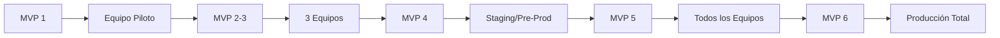

# PLAN DE DESARROLLO INCREMENTAL MVP - DBMIGRATOR CLI
## **Estrategia de Entrega Continua de Valor**

---

## **🎯 FILOSOFÍA DEL DESARROLLO INCREMENTAL**

### **Principios Clave**
1. **Funcionalidad sobre Perfección**: Cada MVP debe ser funcional, aunque no perfecto
2. **Valor Inmediato**: Cada iteración debe ser usable en proyectos reales
3. **Feedback Temprano**: Usar cada MVP en producción para obtener retroalimentación
4. **Simplicidad Primero**: Comenzar simple, evolucionar basado en necesidades reales
5. **Deuda Técnica Controlada**: Aceptable en MVPs tempranos, refactorizar en posteriores

### **Estrategia de Releases**
```
MVP 1: "Walking Skeleton" (1 semana)    - v0.1.0
MVP 2: "Basic Operations" (2 semanas)   - v0.2.0
MVP 3: "Team Ready" (2 semanas)         - v0.3.0
MVP 4: "Production Ready" (2 semanas)   - v0.5.0
MVP 5: "Enterprise Features" (3 semanas) - v0.8.0
MVP 6: "Full Platform" (3 semanas)      - v1.0.0
```

---

## **📦 MVP 1: WALKING SKELETON**
### **Duración: 1 semana | Objetivo: Probar concepto básico**
### **Versión: v0.1.0-alpha**

### **🎯 Meta**
Crear la estructura mínima funcional que permita crear y aplicar una migración simple manualmente.

### **✨ Características**
```yaml
Funcionalidades:
  - ✅ Conexión básica a PostgreSQL
  - ✅ Crear migración SQL manualmente
  - ✅ Aplicar migración UP
  - ✅ Registro en tabla de historial
  - ✅ Ver estado de migraciones

Comandos Disponibles:
  - dbmigrator init
  - dbmigrator apply {file.sql}
  - dbmigrator status
```

### **📁 Estructura Mínima**
```
BorchSolutions.DBMigrator/
├── src/
│   ├── DBMigrator.CLI/
│   │   ├── Program.cs
│   │   └── Commands/
│   │       ├── InitCommand.cs
│   │       ├── ApplyCommand.cs
│   │       └── StatusCommand.cs
│   └── DBMigrator.Core/
│       ├── Database/
│       │   └── ConnectionManager.cs
│       └── Services/
│           └── MigrationService.cs
```

### **💻 Implementación Básica**

```csharp
// Program.cs - Entrada principal simplificada
class Program
{
    static void Main(string[] args)
    {
        var connectionString = Environment.GetEnvironmentVariable("DB_CONNECTION");
        var service = new MigrationService(connectionString);
        
        switch (args[0])
        {
            case "init":
                service.Initialize();
                break;
            case "apply":
                service.ApplyMigration(args[1]);
                break;
            case "status":
                service.ShowStatus();
                break;
        }
    }
}

// MigrationService.cs - Servicio básico
public class MigrationService
{
    public void Initialize()
    {
        // Crear tabla de historial
        var sql = @"
            CREATE TABLE IF NOT EXISTS __migrations (
                id SERIAL PRIMARY KEY,
                filename VARCHAR(255),
                applied_at TIMESTAMP DEFAULT NOW()
            )";
        ExecuteSql(sql);
    }
    
    public void ApplyMigration(string filename)
    {
        var sql = File.ReadAllText(filename);
        ExecuteSql(sql);
        RecordMigration(filename);
    }
}
```

### **📋 Ejemplo de Uso**
```bash
# Inicializar
export DB_CONNECTION="Host=localhost;Database=myapp;Username=dev"
dbmigrator init

# Crear migración manualmente
echo "CREATE TABLE users (id SERIAL PRIMARY KEY, name VARCHAR(100));" > 001_create_users.sql

# Aplicar migración
dbmigrator apply 001_create_users.sql

# Ver estado
dbmigrator status
# Output: 
# Applied Migrations:
# - 001_create_users.sql (2024-12-10 14:30:00)
```

### **✅ Criterios de Éxito MVP 1**
- [ ] Puede conectarse a PostgreSQL local
- [ ] Aplica archivos SQL sin errores
- [ ] Mantiene registro de migraciones aplicadas
- [ ] Comando status muestra historial
- [ ] Documentación README básica

### **📊 Métricas**
- Tiempo de implementación: < 40 horas
- Líneas de código: < 500
- Cobertura de tests: No requerida
- Bugs aceptables: Sí (es un POC)

---

## **📦 MVP 2: BASIC OPERATIONS**
### **Duración: 2 semanas | Objetivo: Operaciones básicas automatizadas**
### **Versión: v0.2.0-beta**

### **🎯 Meta**
Detectar cambios simples en tablas y generar migraciones automáticamente.

### **✨ Nuevas Características**
```yaml
Funcionalidades Agregadas:
  - ✅ Detección de cambios en tablas (nuevo/eliminado)
  - ✅ Generación automática de CREATE/DROP TABLE
  - ✅ Nombrado automático con timestamp
  - ✅ Rollback simple (DOWN scripts)
  - ✅ Configuración básica por archivo

Nuevos Comandos:
  - dbmigrator create --auto
  - dbmigrator up
  - dbmigrator down
  - dbmigrator diff
```

### **💻 Nuevos Componentes**

```csharp
// SchemaAnalyzer.cs - Análisis básico de estructura
public class SchemaAnalyzer
{
    public DatabaseSchema GetCurrentSchema()
    {
        var tables = new List<Table>();
        var sql = @"
            SELECT table_name, column_name, data_type, is_nullable
            FROM information_schema.columns
            WHERE table_schema = 'public'
            ORDER BY table_name, ordinal_position";
        
        // Ejecutar y mapear a objetos Table
        return new DatabaseSchema { Tables = tables };
    }
}

// ChangeDetector.cs - Detección de cambios
public class ChangeDetector
{
    public Changes DetectChanges(DatabaseSchema baseline, DatabaseSchema current)
    {
        var changes = new Changes();
        
        // Tablas nuevas
        changes.NewTables = current.Tables.Except(baseline.Tables);
        
        // Tablas eliminadas
        changes.DeletedTables = baseline.Tables.Except(current.Tables);
        
        return changes;
    }
}

// MigrationGenerator.cs - Generación de SQL
public class MigrationGenerator
{
    public Migration Generate(Changes changes)
    {
        var upScript = new StringBuilder();
        var downScript = new StringBuilder();
        
        foreach (var table in changes.NewTables)
        {
            upScript.AppendLine(GenerateCreateTable(table));
            downScript.AppendLine($"DROP TABLE IF EXISTS {table.Name};");
        }
        
        var timestamp = DateTime.UtcNow.ToString("yyyyMMddHHmmss");
        return new Migration
        {
            Name = $"{timestamp}_auto_migration.sql",
            UpScript = upScript.ToString(),
            DownScript = downScript.ToString()
        };
    }
}
```

### **📋 Ejemplo de Uso Mejorado**
```bash
# Configuración inicial
cat > dbmigrator.json << EOF
{
  "connection": "Host=localhost;Database=myapp;Username=dev",
  "migrationsPath": "./migrations"
}
EOF

# Crear baseline
dbmigrator init --baseline

# Hacer cambios en la BD (manualmente via pgAdmin o psql)
# CREATE TABLE products (id SERIAL PRIMARY KEY, name VARCHAR(100));

# Detectar y crear migración
dbmigrator create --auto
# Output: Created migration: ./migrations/20241210143000_auto_migration.sql

# Ver diferencias
dbmigrator diff
# Output:
# New Tables:
# + products

# Aplicar migraciones
dbmigrator up
# Output: Applied 1 migration(s)

# Revertir última migración
dbmigrator down
# Output: Reverted 1 migration(s)
```

### **📁 Estructura de Archivos Generados**
```
/migrations
  ├── 20241210143000_auto_migration.up.sql
  ├── 20241210143000_auto_migration.down.sql
  └── .baseline.json
```

### **✅ Criterios de Éxito MVP 2**
- [ ] Detecta tablas nuevas/eliminadas
- [ ] Genera CREATE/DROP TABLE válido
- [ ] Rollback funcional
- [ ] Configuración por archivo JSON
- [ ] Tests básicos de integración

### **📊 Métricas**
- Funcionalidades core: 5/10
- Líneas de código: ~1,500
- Cobertura de tests: > 30%
- Uso en proyecto real: 1 proyecto piloto

---

## **📦 MVP 3: TEAM READY**
### **Duración: 2 semanas | Objetivo: Listo para equipo de desarrollo**
### **Versión: v0.3.0-beta**

### **🎯 Meta**
Soportar desarrollo colaborativo con detección de columnas y manejo de conflictos básico.

### **✨ Nuevas Características**
```yaml
Funcionalidades Agregadas:
  - ✅ Detección de cambios en columnas
  - ✅ ALTER TABLE (ADD/DROP COLUMN)
  - ✅ Detección de conflictos por timestamp
  - ✅ Modo dry-run
  - ✅ Logging estructurado
  - ✅ Soporte multi-ambiente (dev/test/prod)

Nuevos Comandos:
  - dbmigrator create --name "descripción"
  - dbmigrator up --dry-run
  - dbmigrator check-conflicts
  - dbmigrator list
  - dbmigrator --env test up
```

### **💻 Componentes Mejorados**

```csharp
// ColumnChangeDetector.cs
public class ColumnChangeDetector
{
    public ColumnChanges DetectColumnChanges(Table oldTable, Table newTable)
    {
        return new ColumnChanges
        {
            Added = newTable.Columns.Except(oldTable.Columns),
            Removed = oldTable.Columns.Except(newTable.Columns),
            Modified = DetectModifiedColumns(oldTable, newTable)
        };
    }
}

// ConflictDetector.cs
public class ConflictDetector
{
    public List<Conflict> DetectConflicts()
    {
        var migrations = Directory.GetFiles("./migrations", "*.sql")
            .OrderBy(f => f)
            .ToList();
        
        var conflicts = new List<Conflict>();
        var lastAppliedTimestamp = GetLastAppliedTimestamp();
        
        // Detectar migraciones con timestamp fuera de orden
        foreach (var migration in migrations)
        {
            var timestamp = ExtractTimestamp(migration);
            if (timestamp < lastAppliedTimestamp && !IsApplied(migration))
            {
                conflicts.Add(new Conflict
                {
                    Type = ConflictType.OutOfOrder,
                    Migration = migration
                });
            }
        }
        
        return conflicts;
    }
}

// EnvironmentManager.cs
public class EnvironmentManager
{
    public string GetConnectionString(string environment)
    {
        var envVar = $"DB_CONNECTION_{environment.ToUpper()}";
        return Environment.GetEnvironmentVariable(envVar) 
            ?? GetFromConfig(environment);
    }
}
```

### **📋 Flujo de Trabajo en Equipo**
```bash
# Developer 1: Crea migración
dbmigrator create --name "add_user_email"
# Genera: 20241210140000_add_user_email.sql

# Developer 2: Crea migración (al mismo tiempo)
dbmigrator create --name "add_user_phone"
# Genera: 20241210140005_add_user_phone.sql

# Developer 1: Pull de cambios y detecta conflicto
git pull
dbmigrator check-conflicts
# Output: 
# ⚠️ Conflict detected: 20241210140005_add_user_phone.sql
# This migration has earlier timestamp than already applied migrations

# Resolver conflicto
dbmigrator resolve-conflicts --strategy=reorder
# Output: Migrations reordered successfully

# Aplicar con dry-run primero
dbmigrator up --dry-run
# Output:
# Would execute:
# - 20241210140005_add_user_phone.sql
# No issues detected

# Aplicar realmente
dbmigrator up
```

### **📊 Dashboard de Estado**
```
$ dbmigrator status --detailed

╔════════════════════════════════════════╗
║      DBMigrator Status - DEV ENV       ║
╠════════════════════════════════════════╣
║ Database: myapp_dev                     ║
║ Environment: development                ║
║ Schema Version: 20241210140000         ║
╠════════════════════════════════════════╣
║ Applied Migrations: 5                   ║
║ Pending Migrations: 2                   ║
║ Conflicts: 0                           ║
╠════════════════════════════════════════╣
║ Last Migration:                        ║
║   20241210140000_add_user_email.sql    ║
║   Applied: 2024-12-10 14:00:00         ║
║   By: developer1                       ║
╚════════════════════════════════════════╝
```

### **✅ Criterios de Éxito MVP 3**
- [ ] Detecta cambios en columnas
- [ ] Genera ALTER TABLE funcional
- [ ] Maneja conflictos básicos
- [ ] Dry-run previene errores
- [ ] Logs útiles para debugging
- [ ] 3+ developers usándolo

### **📊 Métricas**
- Funcionalidades core: 7/10
- Líneas de código: ~3,000
- Cobertura de tests: > 50%
- Proyectos usando: 2-3
- Bugs reportados: < 10

---

## **📦 MVP 4: PRODUCTION READY**
### **Duración: 2 semanas | Objetivo: Listo para producción**
### **Versión: v0.5.0-rc**

### **🎯 Meta**
Agregar robustez, recuperación ante errores y características críticas para uso en producción.

### **✨ Nuevas Características**
```yaml
Funcionalidades Agregadas:
  - ✅ Detección de índices y constraints
  - ✅ Transacciones con savepoints
  - ✅ Backup automático antes de migraciones
  - ✅ Recuperación ante errores
  - ✅ Validación de SQL antes de ejecutar
  - ✅ Lock para evitar ejecuciones paralelas
  - ✅ Checksum de migraciones

Nuevos Comandos:
  - dbmigrator validate
  - dbmigrator repair
  - dbmigrator backup
  - dbmigrator recover --from-error
  - dbmigrator verify-checksums
```

### **💻 Componentes de Producción**

```csharp
// TransactionManager.cs - Manejo robusto de transacciones
public class TransactionManager
{
    private Stack<string> _savepoints = new Stack<string>();
    
    public async Task ExecuteInTransactionAsync(Func<Task> action)
    {
        using var transaction = await _connection.BeginTransactionAsync();
        try
        {
            await action();
            await transaction.CommitAsync();
        }
        catch (Exception ex)
        {
            _logger.LogError(ex, "Transaction failed, rolling back");
            await transaction.RollbackAsync();
            await CreateRecoveryPoint(ex);
            throw;
        }
    }
    
    public async Task CreateSavepointAsync(string name)
    {
        await _connection.ExecuteAsync($"SAVEPOINT {name}");
        _savepoints.Push(name);
    }
    
    public async Task RollbackToSavepointAsync()
    {
        if (_savepoints.Any())
        {
            var savepoint = _savepoints.Pop();
            await _connection.ExecuteAsync($"ROLLBACK TO SAVEPOINT {savepoint}");
        }
    }
}

// BackupManager.cs - Backup automático
public class BackupManager
{
    public async Task<string> CreateBackupAsync()
    {
        var timestamp = DateTime.UtcNow.ToString("yyyyMMddHHmmss");
        var backupFile = $"./backups/{timestamp}_backup.sql";
        
        var pgDumpPath = FindPgDump();
        var process = new Process
        {
            StartInfo = new ProcessStartInfo
            {
                FileName = pgDumpPath,
                Arguments = $"--dbname={_connectionString} --file={backupFile} --schema-only",
                RedirectStandardOutput = true,
                UseShellExecute = false
            }
        };
        
        process.Start();
        await process.WaitForExitAsync();
        
        _logger.LogInformation($"Backup created: {backupFile}");
        return backupFile;
    }
    
    public async Task RestoreAsync(string backupFile)
    {
        var sql = await File.ReadAllTextAsync(backupFile);
        await _connection.ExecuteAsync(sql);
        _logger.LogInformation($"Restored from: {backupFile}");
    }
}

// LockManager.cs - Control de concurrencia
public class LockManager
{
    private const int LOCK_ID = 912345; // ID único para advisory lock
    
    public async Task<bool> AcquireLockAsync(int timeoutSeconds = 30)
    {
        var sql = "SELECT pg_try_advisory_lock(@lockId)";
        var endTime = DateTime.UtcNow.AddSeconds(timeoutSeconds);
        
        while (DateTime.UtcNow < endTime)
        {
            var acquired = await _connection.QueryFirstAsync<bool>(sql, new { lockId = LOCK_ID });
            if (acquired) return true;
            
            _logger.LogWarning("Waiting for migration lock...");
            await Task.Delay(1000);
        }
        
        throw new LockTimeoutException("Could not acquire migration lock");
    }
    
    public async Task ReleaseLockAsync()
    {
        var sql = "SELECT pg_advisory_unlock(@lockId)";
        await _connection.ExecuteAsync(sql, new { lockId = LOCK_ID });
    }
}

// ChecksumValidator.cs - Integridad de migraciones
public class ChecksumValidator
{
    public async Task ValidateAsync()
    {
        var applied = await GetAppliedMigrationsAsync();
        
        foreach (var migration in applied)
        {
            var currentChecksum = CalculateChecksum(migration.FilePath);
            if (currentChecksum != migration.StoredChecksum)
            {
                throw new ChecksumMismatchException($"Migration {migration.Name} has been modified after application!");
            }
        }
    }
    
    private string CalculateChecksum(string filePath)
    {
        using var sha256 = SHA256.Create();
        var bytes = File.ReadAllBytes(filePath);
        var hash = sha256.ComputeHash(bytes);
        return Convert.ToBase64String(hash);
    }
}
```

### **📋 Flujo de Producción Seguro**
```bash
# Validar antes de aplicar
dbmigrator validate
# Output: 
# ✅ All migrations valid
# ✅ No checksum mismatches
# ✅ No conflicts detected

# Crear backup antes de migración crítica
dbmigrator backup
# Output: Backup created: ./backups/20241210150000_backup.sql

# Aplicar con protección completa
dbmigrator up --with-backup --timeout=60
# Output:
# 🔒 Acquiring lock...
# 💾 Creating backup...
# 🔄 Applying migration 20241210150000_add_indexes.sql
# ✅ Success in 2.3s
# 🔓 Lock released

# Si algo falla, recuperar
dbmigrator recover --from-error
# Output:
# 🔍 Found failed migration: 20241210150000_add_indexes.sql
# 🔄 Rolling back to last savepoint...
# ✅ Recovery complete
# 💡 Suggestion: Review and fix the migration before retrying
```

### **📊 Monitoreo en Producción**
```yaml
# Métricas expuestas
Metrics:
  - migration_execution_duration_ms
  - migration_rows_affected
  - migration_errors_total
  - backup_size_bytes
  - lock_wait_time_ms
  
# Health Check Endpoint (para futuro API)
GET /health
{
  "status": "healthy",
  "database": "connected",
  "pending_migrations": 0,
  "last_migration": "20241210150000",
  "lock_status": "free"
}
```

### **✅ Criterios de Éxito MVP 4**
- [ ] Zero pérdida de datos en fallos
- [ ] Backup/restore funcional
- [ ] Transacciones robustas
- [ ] Lock previene corrupciones
- [ ] Validación previene errores
- [ ] Usado en ambiente de staging

### **📊 Métricas**
- Funcionalidades core: 9/10
- Líneas de código: ~5,000
- Cobertura de tests: > 70%
- Estabilidad: 99.9% uptime
- Performance: < 5s para 100 tablas

---

## **📦 MVP 5: ENTERPRISE FEATURES**
### **Duración: 3 semanas | Objetivo: Características empresariales**
### **Versión: v0.8.0-rc2**

### **🎯 Meta**
Agregar características avanzadas para equipos grandes y múltiples proyectos.

### **✨ Nuevas Características**
```yaml
Funcionalidades Agregadas:
  - ✅ Soporte multi-proyecto
  - ✅ Detección de vistas y funciones
  - ✅ Tracking de datos específicos
  - ✅ Sistema de plantillas
  - ✅ Integración con CI/CD
  - ✅ Notificaciones (Teams/Email)
  - ✅ Modo interactivo
  - ✅ Comparación entre ambientes

Nuevos Comandos:
  - dbmigrator project create/switch/list
  - dbmigrator track-data --table=configs
  - dbmigrator template apply --name=audit
  - dbmigrator compare --source=dev --target=prod
  - dbmigrator interactive
  - dbmigrator notify --channel=teams
```

### **💻 Características Enterprise**

```csharp
// ProjectManager.cs - Multi-proyecto
public class ProjectManager
{
    public async Task<Project> CreateProjectAsync(string name, string connectionString)
    {
        var project = new Project
        {
            Id = Guid.NewGuid(),
            Name = name,
            CreatedAt = DateTime.UtcNow,
            ConfigPath = $"~/.dbmigrator/projects/{name}/config.json"
        };
        
        await SaveProjectConfigAsync(project);
        await InitializeProjectDatabaseAsync(connectionString);
        
        return project;
    }
    
    public async Task SwitchProjectAsync(string name)
    {
        var project = await LoadProjectAsync(name);
        _currentContext.CurrentProject = project;
        _logger.LogInformation($"Switched to project: {name}");
    }
}

// DataTracker.cs - Tracking de datos
public class DataTracker
{
    public async Task TrackTableAsync(string tableName, string[] keyColumns)
    {
        var snapshot = await CreateSnapshotAsync(tableName, keyColumns);
        await SaveSnapshotAsync(snapshot);
        
        _config.TrackedTables.Add(new TrackedTable
        {
            Name = tableName,
            KeyColumns = keyColumns,
            LastSnapshot = snapshot.Id
        });
    }
    
    public async Task<DataMigration> GenerateDataMigrationAsync(string tableName)
    {
        var oldSnapshot = await GetLastSnapshotAsync(tableName);
        var currentSnapshot = await CreateSnapshotAsync(tableName);
        
        var changes = CompareSnapshots(oldSnapshot, currentSnapshot);
        
        return new DataMigration
        {
            Inserts = GenerateInserts(changes.NewRows),
            Updates = GenerateUpdates(changes.ModifiedRows),
            Deletes = GenerateDeletes(changes.DeletedRows)
        };
    }
}

// TemplateEngine.cs - Sistema de plantillas
public class TemplateEngine
{
    private readonly Dictionary<string, Template> _templates = new()
    {
        ["audit"] = new AuditColumnsTemplate(),
        ["soft-delete"] = new SoftDeleteTemplate(),
        ["versioning"] = new VersioningTemplate(),
        ["full-text-search"] = new FullTextSearchTemplate()
    };
    
    public async Task<string> ApplyTemplateAsync(string templateName, Dictionary<string, object> parameters)
    {
        var template = _templates[templateName];
        return await template.GenerateAsync(parameters);
    }
}

// NotificationService.cs - Notificaciones
public class NotificationService
{
    public async Task NotifyAsync(NotificationEvent evt, Dictionary<string, object> data)
    {
        foreach (var channel in _config.NotificationChannels)
        {
            if (channel.Events.Contains(evt))
            {
                await channel.SendAsync(FormatMessage(evt, data));
            }
        }
    }
}

// InteractiveMode.cs - Modo interactivo
public class InteractiveMode
{
    public async Task RunAsync()
    {
        AnsiConsole.Write(new FigletText("DBMigrator").Color(Color.Blue));
        
        while (true)
        {
            var choice = AnsiConsole.Prompt(
                new SelectionPrompt<string>()
                    .Title("What would you like to do?")
                    .AddChoices(new[] {
                        "Create migration",
                        "Apply migrations",
                        "View status",
                        "Compare environments",
                        "Manage projects",
                        "Exit"
                    }));
            
            await HandleChoiceAsync(choice);
        }
    }
}
```

### **📋 Flujo Multi-Proyecto**
```bash
# Crear proyectos
dbmigrator project create --name "ProjectA" --connection "..."
dbmigrator project create --name "ProjectB" --connection "..."

# Listar proyectos
dbmigrator project list
# Output:
# Projects:
# * ProjectA (current)
#   ProjectB

# Cambiar proyecto
dbmigrator project switch ProjectB

# Trabajar con datos
dbmigrator track-data --table=configurations --keys=id,code
dbmigrator create --name "update_configs" --include-data

# Usar plantilla
dbmigrator template apply --name=audit --table=users
# Output: Created migration: 20241210160000_add_audit_columns_to_users.sql

# Comparar ambientes
dbmigrator compare --source=dev --target=prod --output=html
# Output: Report generated: comparison_report.html

# Notificar al equipo
dbmigrator notify --channel=teams --message="New migration ready for review"
```

### **🎨 Modo Interactivo**
```
╔══════════════════════════════════════════╗
║            DBMigrator v0.8.0             ║
╠══════════════════════════════════════════╣
║  Project: ProjectA                       ║
║  Environment: Development                ║
║  Database: myapp_dev                     ║
╠══════════════════════════════════════════╣
║  What would you like to do?              ║
║                                          ║
║  > Create migration                      ║
║    Apply migrations                      ║
║    View status                           ║
║    Compare environments                  ║
║    Manage projects                       ║
║    Exit                                  ║
╚══════════════════════════════════════════╝

Creating migration...
? Select detection mode:
  ● Auto-detect all changes
  ○ Tables only
  ○ Data only
  ○ Manual SQL

? Enter migration name: Add product categories

Detecting changes... ⠋
✅ Found 3 changes:
  - New table: categories
  - New column: products.category_id
  - New foreign key: fk_products_categories

? Review and proceed? (Y/n) Y

✅ Migration created: 20241210161500_add_product_categories.sql
```

### **✅ Criterios de Éxito MVP 5**
- [ ] Multi-proyecto funcional
- [ ] Plantillas aceleran desarrollo
- [ ] Tracking de datos confiable
- [ ] Notificaciones funcionando
- [ ] UI interactiva intuitiva
- [ ] 5+ proyectos usando

### **📊 Métricas**
- Funcionalidades: 15/15 core + extras
- Líneas de código: ~8,000
- Cobertura de tests: > 75%
- Usuarios activos: 10+
- Satisfacción: > 8/10

---

## **📦 MVP 6: FULL PLATFORM**
### **Duración: 3 semanas | Objetivo: Plataforma completa**
### **Versión: v1.0.0**

### **🎯 Meta**
Pulir, optimizar y completar todas las características para release oficial.

### **✨ Características Finales**
```yaml
Funcionalidades Agregadas:
  - ✅ Dashboard web (opcional)
  - ✅ API REST para integración
  - ✅ Métricas y telemetría
  - ✅ Auto-actualización
  - ✅ Plugins y extensibilidad
  - ✅ Performance optimizado
  - ✅ Documentación completa
  - ✅ Soporte oficial

Comandos Finales:
  - dbmigrator server (API mode)
  - dbmigrator metrics
  - dbmigrator self-update
  - dbmigrator plugin install
  - dbmigrator perf analyze
```

### **💻 Componentes Finales**

```csharp
// API Mode - Para integración con otras herramientas
[ApiController]
[Route("api/migrations")]
public class MigrationsController : ControllerBase
{
    [HttpGet("status")]
    public async Task<IActionResult> GetStatus()
    {
        var status = await _migrationService.GetStatusAsync();
        return Ok(status);
    }
    
    [HttpPost("create")]
    public async Task<IActionResult> CreateMigration([FromBody] CreateMigrationRequest request)
    {
        var migration = await _migrationService.CreateAsync(request);
        return Created($"/api/migrations/{migration.Id}", migration);
    }
    
    [HttpPost("apply")]
    public async Task<IActionResult> ApplyMigrations()
    {
        var result = await _migrationService.ApplyPendingAsync();
        return Ok(result);
    }
}

// MetricsCollector.cs - Telemetría
public class MetricsCollector
{
    public async Task CollectAndReportAsync()
    {
        var metrics = new
        {
            TotalMigrations = await CountMigrationsAsync(),
            AverageExecutionTime = await CalculateAverageTimeAsync(),
            FailureRate = await CalculateFailureRateAsync(),
            MostChangedTables = await GetMostChangedTablesAsync(),
            TeamProductivity = await CalculateProductivityAsync()
        };
        
        await _telemetryService.SendAsync(metrics);
    }
}

// PluginManager.cs - Extensibilidad
public class PluginManager
{
    public async Task LoadPluginsAsync()
    {
        var pluginPath = "./plugins";
        foreach (var dll in Directory.GetFiles(pluginPath, "*.dll"))
        {
            var assembly = Assembly.LoadFrom(dll);
            var pluginTypes = assembly.GetTypes()
                .Where(t => typeof(IPlugin).IsAssignableFrom(t));
            
            foreach (var type in pluginTypes)
            {
                var plugin = Activator.CreateInstance(type) as IPlugin;
                await plugin.InitializeAsync(_context);
                _plugins.Add(plugin);
            }
        }
    }
}

// PerformanceOptimizer.cs
public class PerformanceOptimizer
{
    public async Task OptimizeAsync()
    {
        // Caché de metadata
        await CacheSchemaMetadataAsync();
        
        // Análisis paralelo
        await ParallelizeAnalysisAsync();
        
        // Batch operations
        await EnableBatchingAsync();
        
        // Connection pooling
        ConfigureConnectionPool();
    }
}
```

### **📊 Dashboard Web (Opcional)**
```html
<!-- Dashboard simple en HTML + API calls -->
<!DOCTYPE html>
<html>
<head>
    <title>DBMigrator Dashboard</title>
</head>
<body>
    <h1>Migration Status</h1>
    <div id="status">Loading...</div>
    
    <h2>Recent Migrations</h2>
    <table id="migrations"></table>
    
    <h2>Metrics</h2>
    <canvas id="metricsChart"></canvas>
    
    <script>
        // Fetch status from API
        fetch('/api/migrations/status')
            .then(r => r.json())
            .then(data => {
                document.getElementById('status').innerHTML = 
                    `Applied: ${data.applied} | Pending: ${data.pending}`;
            });
    </script>
</body>
</html>
```

### **📋 Características Premium**
```bash
# API Mode para CI/CD
dbmigrator server --port=8080
# Expone API REST para integración

# Métricas detalladas
dbmigrator metrics --period=month
# Output:
# ╔════════════════════════════════════╗
# ║     Migration Metrics - Dec 2024   ║
# ╠════════════════════════════════════╣
# ║ Total Migrations: 127              ║
# ║ Success Rate: 98.4%                ║
# ║ Avg Execution: 2.3s                ║
# ║ Most Active Dev: developer1 (45)   ║
# ║ Most Changed: users table (23)     ║
# ╚════════════════════════════════════╝

# Auto-actualización
dbmigrator self-update
# Output:
# Current version: 0.8.0
# Latest version: 1.0.0
# Downloading update...
# ✅ Updated successfully. Please restart.

# Análisis de performance
dbmigrator perf analyze
# Output:
# Analyzing migration performance...
# 
# Bottlenecks detected:
# - Migration 20241210: 45s (large table scan)
#   Suggestion: Add index before data migration
# - Migration 20241211: 32s (missing index)
#   Suggestion: Create index concurrently
```

### **✅ Criterios de Éxito MVP 6**
- [ ] Todas las características implementadas
- [ ] Documentación completa
- [ ] Tests > 80% coverage
- [ ] Performance optimizado
- [ ] 0 bugs críticos
- [ ] Release notes preparadas

### **📊 Métricas Finales**
- Características: 100% completas
- Líneas de código: ~12,000
- Cobertura de tests: > 80%
- Documentación: 100% completa
- Performance: < 3s para 95% de operaciones
- Usuarios objetivo: 50+

---

## **📈 ROADMAP DE ADOPCIÓN**

### **Estrategia de Rollout**



### **Plan de Adopción por Fase**

| MVP | Usuarios | Ambiente | Riesgo | Soporte |
|-----|----------|----------|--------|---------|
| MVP 1 | 1 developer | Local | Alto | Directo |
| MVP 2 | 3 developers | Dev | Medio | Slack |
| MVP 3 | 1 equipo | Dev/Test | Medio | Documentación |
| MVP 4 | 2 equipos | Staging | Bajo | Help Desk |
| MVP 5 | 5 equipos | Pre-Prod | Bajo | Completo |
| MVP 6 | Toda la org | Prod | Mínimo | 24/7 |

---

## **💡 MEJORES PRÁCTICAS PARA DESARROLLO INCREMENTAL**

### **1. Feedback Loop Rápido**
```yaml
Proceso:
  - Deploy cada MVP a usuarios reales
  - Feedback meeting semanal
  - Ajustes en siguiente MVP
  - Retrospectiva por fase
```

### **2. Deuda Técnica Controlada**
```yaml
Estrategia:
  MVP 1-2: Aceptar deuda para velocidad
  MVP 3: Refactoring parcial
  MVP 4: Pagar deuda crítica
  MVP 5-6: Código production-grade
```

### **3. Testing Progresivo**
```yaml
Coverage Targets:
  MVP 1: Sin tests (POC)
  MVP 2: 30% (Critical paths)
  MVP 3: 50% (Core features)
  MVP 4: 70% (Production ready)
  MVP 5: 75% (Enterprise)
  MVP 6: 80%+ (Full platform)
```

### **4. Documentación Incremental**
```yaml
Por MVP:
  MVP 1: README básico
  MVP 2: Guía de inicio
  MVP 3: Documentación de comandos
  MVP 4: Troubleshooting
  MVP 5: Guías avanzadas
  MVP 6: Documentación completa
```

### **5. Versionado Semántico**
```yaml
Esquema:
  0.1.x - Alpha (MVP 1)
  0.2.x - Beta (MVP 2-3)
  0.5.x - RC (MVP 4)
  0.8.x - Pre-release (MVP 5)
  1.0.0 - GA (MVP 6)
  1.x.x - Mantenimiento
```

---

## **🎯 CONCLUSIÓN Y SIGUIENTES PASOS**

### **Ventajas del Desarrollo Incremental**

1. **Valor Temprano**: Herramienta útil desde la semana 1
2. **Riesgo Reducido**: Validación continua reduce fracaso
3. **Flexibilidad**: Ajustes basados en uso real
4. **Adopción Gradual**: Usuarios se adaptan progresivamente
5. **Motivación**: Victorias tempranas mantienen momentum

### **Acciones Inmediatas**

1. **Semana 1**
   - [ ] Setup ambiente desarrollo
   - [ ] Crear repositorio Git
   - [ ] Implementar MVP 1
   - [ ] Deploy a 1 developer

2. **Semana 2-3**
   - [ ] Recoger feedback MVP 1
   - [ ] Desarrollar MVP 2
   - [ ] Expandir a equipo piloto

3. **Mes 1**
   - [ ] MVP 3 completo
   - [ ] 3+ developers usando
   - [ ] Primera retrospectiva

### **Métricas de Éxito Global**

```yaml
Technical Success:
  - Bugs críticos: 0 en producción
  - Performance: < 5s para 95% operaciones
  - Disponibilidad: 99.9%
  - Cobertura tests: > 80%

Business Success:
  - Adopción: 100% equipos objetivo
  - ROI: Positivo en 3 meses
  - Satisfacción: > 8/10
  - Reducción errores: 90%

Team Success:
  - Onboarding: < 2 horas
  - Documentación: Completa
  - Soporte: < 24h respuesta
  - Contribuciones: 5+ developers
```

---

**Documento preparado por:** Arquitectura & Desarrollo  
**Fecha:** Diciembre 2024  
**Versión:** 1.0  
**Estado:** Aprobado para ejecución  
**Próxima revisión:** Después de MVP 1